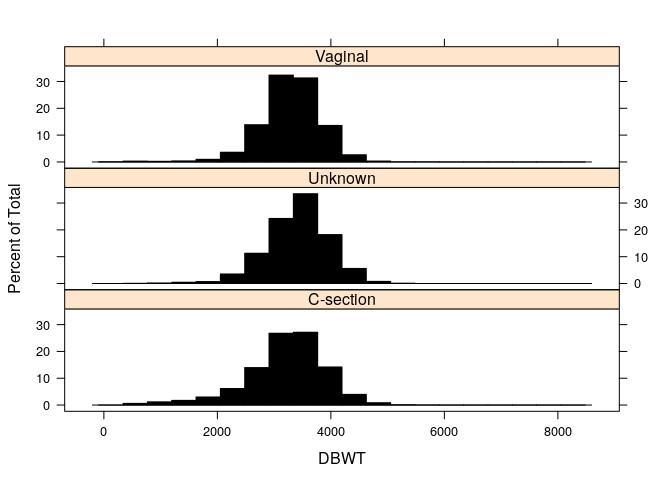
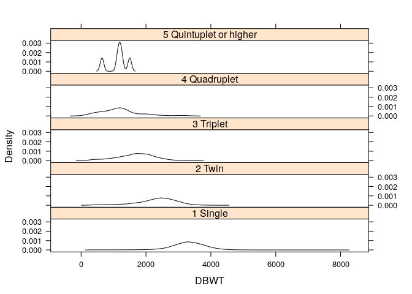
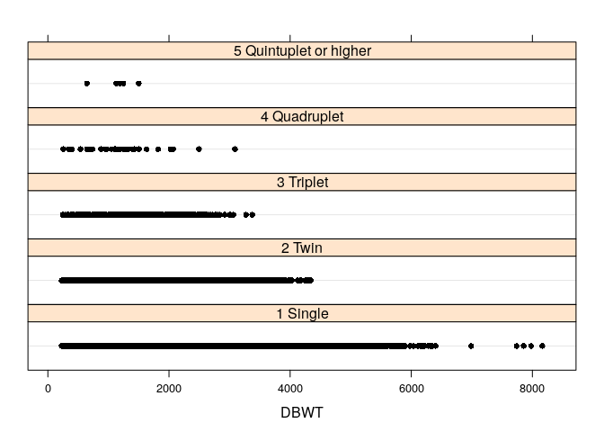

## Capitulo 2
### Procesando la Informacion y Conociendo sus Datos
Aqui analizamos tres conjuntos de datos para ilustrar los pasos necesarios para procesar los datos:

1. Los datos de nacimientos en el 2006: 427.323 registros y 13 variables.

2. Las donaciones a un colegio privado del medio oeste: 1.230 registros y 11 variables.

3. Los datos de jugo de naranja: 28.947 registros y 17 variables.

Los conjuntos de datos incluyen variables continuas y categoricas, tienen datos faltantes y requieren preprocesamiento, antes del analisis estadistico y el modelado. Usamos estos datasets para mostrar como resuir la informacion y como obtener graficos utiles.

### Ejemplo 1: Datos de nacimientos del 2006

El paquete *births2006.smpl* tiene 13 variables que incluyen dia del nacimiento en el mes y en la semana (DOB_MM, DOB_WK), peso al nacer (DBWT), peso ganado durante el embarazo (WTGAIN), sexo del bebe y su numero APGAR (SEX y APGAR5), si es parto simple o multiple (DPLURAL), y semanas estimadas de gestacion (ESTGEST).


```r
## Instale los paqueques desde CRAN
install.packages("nutshell")
```

```
## Installing package into '/home/simon/R/x86_64-pc-linux-gnu-library/3.4'
## (as 'lib' is unspecified)
```

```r
library(lattice)
library(nutshell)
```

```
## Loading required package: nutshell.bbdb
```

```
## Loading required package: nutshell.audioscrobbler
```

```r
data(births2006.smpl)
births2006.smpl[1:5,]
```

```
##         DOB_MM DOB_WK MAGER TBO_REC WTGAIN SEX APGAR5
## 591430       9      1    25       2     NA   F     NA
## 1827276      2      6    28       2     26   M      9
## 1705673      2      2    18       2     25   F      9
## 3368269     10      5    21       2      6   M      9
## 2990253      7      7    25       1     36   M     10
##                         DMEDUC UPREVIS ESTGEST DMETH_REC  DPLURAL DBWT
## 591430                    NULL      10      99   Vaginal 1 Single 3800
## 1827276     2 years of college      10      37   Vaginal 1 Single 3625
## 1705673                   NULL      14      38   Vaginal 1 Single 3650
## 3368269                   NULL      22      38   Vaginal 1 Single 3045
## 2990253 2 years of high school      15      40   Vaginal 1 Single 3827
```

```r
dim(births2006.smpl)
```

```
## [1] 427323     13
```

El siguiente grafico de barras de la frecuencias de nacimientos de acuerdo al dia de la semana muestra que los nacimientos durante el fin de semana (dias 1=Domingo, 2=Lunes, ..., 7=Sabado de DOB_WK), fueron menores quee entre semana. Eso se puede deber al hecho de que muchos ninos nacen por cesareas, que se realizan principalmente entre semana. Para probar la hipotesis tomamos las frecuencias de nacimientos de acuerdo al dia de la semana y el metodo de parto. Se exluyen los metodos de nacimiento no conocidos. Los nacimientos por via vaginal son menos frecuentes en fines de semana que entre semana (los doctores prefieren trabajar entre semana), mostrando que los nacimientos por cesareas programadas entre semana contra los de fin de semana (cerca del 50%), exceden la proporcion entre semana/fin de semana, de nacimientos por via vaginal ( cerca de 25%-30%).


```r
births.dow=table(births2006.smpl$DOB_WK)
births.dow
```

```
## 
##     1     2     3     4     5     6     7 
## 40274 62757 69775 70290 70164 68380 45683
```

```r
barchart(births.dow, ylab="Dia de la semana", col="black")
```

<!-- -->

```r
dob.dm.tbl=table(WK=births2006.smpl$DOB_WK,MM=births2006.smpl$DMETH_REC)
dob.dm.tbl
```

```
##    MM
## WK  C-section Unknown Vaginal
##   1      8836      90   31348
##   2     20454     272   42031
##   3     22921     247   46607
##   4     23103     252   46935
##   5     22825     258   47081
##   6     23233     289   44858
##   7     10696     109   34878
```

```r
dob.dm.tbl=dob.dm.tbl[,-2]
dob.dm.tbl
```

```
##    MM
## WK  C-section Vaginal
##   1      8836   31348
##   2     20454   42031
##   3     22921   46607
##   4     23103   46935
##   5     22825   47081
##   6     23233   44858
##   7     10696   34878
```

```r
trellis.device()
barchart(dob.dm.tbl,ylab="Dia de la Semana")
barchart(dob.dm.tbl,horizontal=FALSE,groups=FALSE, xlab="Dia de la Semana",col="black")
```

Se usan graficos de lattice(trellis) para condicionar los histogramas de densidad sobre los valores de la tercera variable. Las variable para multiples nacimientos y el metodo de parto son las variables condicionantes. Como es de esperar, el peso al nacer decrece con multiples nacimientos, aunque no se ve afectado por el metodo de parto. Debido a las pocas muestras de nacimientos de quintuples o superiores, la densidad del peso al nacer para este grupo pequeno es ruidosa. El grafico de puntos muestra claramente las pocas observaciones en este grupo a diferencia de los otros grupos. 


```r
histogram(~DBWT|DPLURAL,data = births2006.smpl,layout=c(1,5), col="black")
```

<!-- -->

```r
histogram(~DBWT|DMETH_REC,data = births2006.smpl,layout=c(1,3), col="black")
```

<!-- -->

```r
densityplot(~DBWT|DPLURAL,data = births2006.smpl,layout=c(1,5), plot.points=FALSE, col="black")
```

<!-- -->

```r
densityplot(~DBWT,groups = DPLURAL,data = births2006.smpl, plot.points=FALSE)
```

<!-- -->

```r
dotplot(~DBWT|DPLURAL,data = births2006.smpl,layout=c(1,5),plot.points=FALSE,col="black")
```

<!-- -->

Los graficos de dispersion (xyplots en el paquete lattice) se muestran para peso al nacer contra peso ganado durante el embarazo, y estan estratificados para multiples nacimientos. El ultimo grafico muestra que hay poca asociacion entre el peso al nacer y el peso ganado durante el embarazo.


```r
xyplot(DBWT~DOB_WK,data = births2006.smpl,col="black")
```

<!-- -->

```r
xyplot(DBWT~DOB_WK|DPLURAL,data = births2006.smpl,layout=c(1,5),col="black")
```

<!-- -->

```r
xyplot(DBWT~WTGAIN,data = births2006.smpl,layout=c(1,5),col="black")
```

<!-- -->

```r
xyplot(DBWT~WTGAIN|DPLURAL,data = births2006.smpl,layout=c(1,5),col="black")
```

<!-- -->

```r
smoothScatter(births2006.smpl$WTGAIN,births2006.smpl$DBWT)
```

<!-- -->

Tambien se muestran diagramas de cajas y bigotes para peso al nacer vs puntaje APGAR y otros para peso al nacer vs dia de la semana del parto. No se espera mucha relacion entre el peso y el dia de la semana. El puntaje APGAR es un indicador de la salud del neonato, con puntuaciones bajas indicando que el bebe experimenta dificultades. El grafico de peso al nacer vs puntaje APGAR muestra una fuerte relacion. Bebes con bajo peso a menudo presentan baja calificacion APGAR ya que su salud esta comprometida por el bajo peso y las complicaciones asociadas.


```r
## boxplot es el comando estandar en el paquete graphics
boxplot(DBWT~APGAR5,data = births2006.smpl,ylab="Peso al Nacer",xlab="APGAR5")
```

<!-- -->

```r
boxplot(DBWT~DOB_WK,data = births2006.smpl,ylab="Peso al Nacer",xlab="Dia de la Semana")
```

<!-- -->

```r
## bwplot es el comando en el paquete grafico lattice. 
# Se deben declarar las variables condicionantes como factores
bwplot(DBWT~factor(APGAR5)|factor(SEX),data = births2006.smpl,xlab = "APGAR5")
```

<!-- -->

```r
bwplot(DBWT~factor(DOB_WK),data = births2006.smpl,xlab="Dia de la Semana")
```

<!-- -->
Tambien se calcula el peso promedio al nacer en funcion de multiples nacimientos, para masculino y femenino por separado. Se usa la funcion tapply para esto. Se nota que hay observaciones perdidas en el conjunto de datos y la opcion *na.rm=TRUE* remueve las observaciones perdidas al realizar el calculo de la media. El grafico de barras muestra como decrece el peso al nacer con los multiples nacimientos. Tambien  muestra que el promedio para hombres es levemente superior que para mujeres.


```r
fac = factor(births2006.smpl$DPLURAL)
res = births2006.smpl$DBWT
t4 = tapply(res, fac, mean, na.rm = TRUE)
t4
```

```
##               1 Single                 2 Twin              3 Triplet 
##               3298.263               2327.478               1677.017 
##           4 Quadruplet 5 Quintuplet or higher 
##               1196.105               1142.800
```

```r
t5=tapply(births2006.smpl$DBWT, INDEX=list(births2006.smpl$DPLURAL, births2006.smpl$SEX), FUN = mean, na.rm = TRUE)
t5
```

```
##                               F        M
## 1 Single               3242.302 3351.637
## 2 Twin                 2279.508 2373.819
## 3 Triplet              1697.822 1655.348
## 4 Quadruplet           1319.556 1085.000
## 5 Quintuplet or higher 1007.667 1345.500
```

```r
barplot(t4, ylab = "DBWT")
```

<!-- -->

```r
barplot(t5, beside = TRUE, ylab = "DBWT")
```

<!-- -->


When you click the **Knit** button a document will be generated that includes both content as well as the output of any embedded R code chunks within the document. You can embed an R code chunk like this:


```r
summary(cars)
```

```
##      speed           dist       
##  Min.   : 4.0   Min.   :  2.00  
##  1st Qu.:12.0   1st Qu.: 26.00  
##  Median :15.0   Median : 36.00  
##  Mean   :15.4   Mean   : 42.98  
##  3rd Qu.:19.0   3rd Qu.: 56.00  
##  Max.   :25.0   Max.   :120.00
```

## Including Plots

You can also embed plots, for example:

<!-- -->

Note that the `echo = FALSE` parameter was added to the code chunk to prevent printing of the R code that generated the plot.
